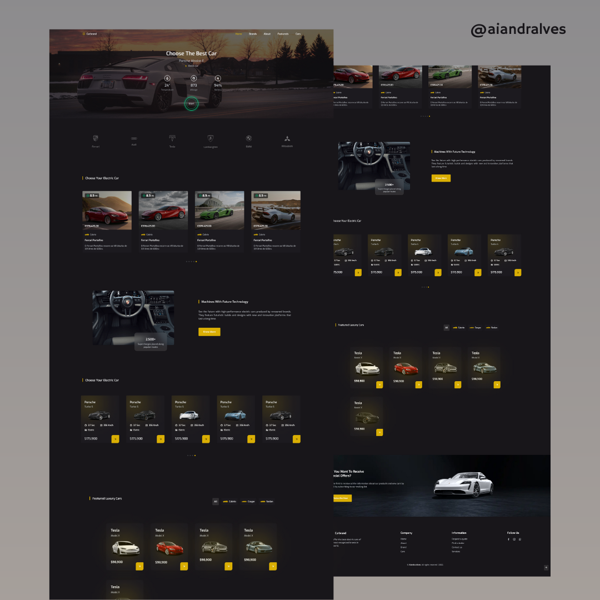

<h2 align="center"> 
	Cardbrand 🚗🛻
</h2>

    

## 💻 Projeto

  Landing page desenvolvida para uma plataforma fictícia de venda ou aluguel de carros de luxo e esportivos. O projeto destaca-se por seu visual sofisticado em dark mode, 
  navegação intuitiva e forte apelo visual com uso de cards de veículos, filtros por categoria (elétrico, esportivo, luxo), e destaques para modelos específicos. 
  Também inclui seções de CTA (call to action), comparativos de preços e vitrine de modelos com destaque de marca.

## ✨ Tecnologias

    
    
    

 

---

## 🤝 Contribuição

Faça um **fork** do repositório e se te ajudei de alguma forma, deixe uma 🌟

---

Feito com ❤ por Aiandra Meira 👋🏻 &nbsp;[Portfólio Pessoal](https://aiandralves.com)
